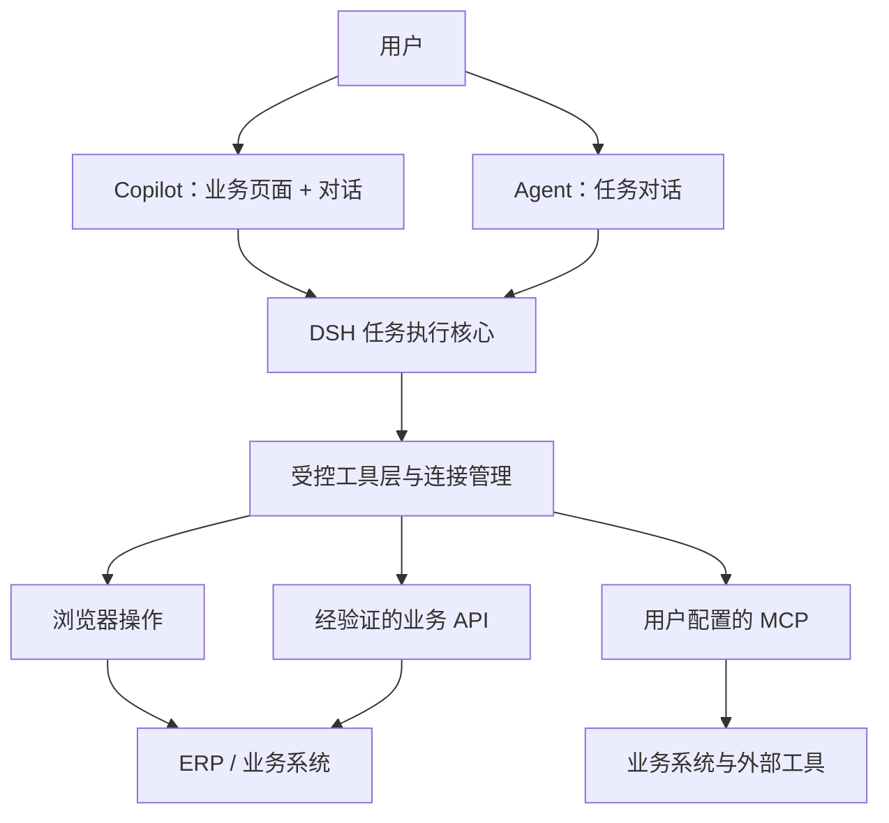

# DSH Deskwork

**登录你的业务系统，让 AI 帮你把事办完。**

An AI desktop workspace for ERP and business operations, powered by DeepSeek Harness.

[English](./README.en.md) · [文档导航](./docs/README.md) · [设计说明](./docs/design/workspace.md) · [路线图](./docs/roadmap.md) · [参与贡献](./CONTRIBUTING.md) · [MIT License](./LICENSE)

DSH Deskwork 计划将 **DeepSeek Harness（DSH）打包进桌面工作台**，让用户在熟悉的 ERP 和其他业务系统中，通过对话查询信息、操作页面、调用业务接口和完成工作流。

产品交互借鉴 VS Code / Cursor 的工作台：业务页面与 AI 并排协作，也可以切换为专注任务的 Agent 对话。面向已有业务系统，尽量降低系统改造和员工使用成本。

> **项目状态：产品设计与仓库初始化。** 当前包含开发规范与隔离技术实验，尚无可运行产品、安装包或已集成的 DSH 运行时。下文描述的是目标能力，实施进度见[路线图](./docs/roadmap.md)。

## 两种工作模式

### Copilot：页面与 AI 并排协作

左侧是传统业务系统，右侧是 DSH 对话。打开系统就像打开浏览器标签页：用户自行输入账号、完成验证码或单点登录，然后让 AI 在选定的已登录会话中协助操作。

```text
┌──────────────────────────────────┬───────────────────────────┐
│ 业务系统 / 浏览器标签页           │ DSH Copilot               │
│                                  │                           │
│ 采购 · 销售 · 库存 · 财务         │ “找出今天待审核的采购单”  │
│                                  │                           │
│ 用户与 AI 共用当前业务页面        │ 查看步骤、确认、暂停、接手 │
└──────────────────────────────────┴───────────────────────────┘
```

- 用户手动登录，不必把账号密码写进对话。
- AI 获取所选页面的上下文，并通过浏览器工具读取、导航、填写和操作。
- 用户可以观察执行过程、暂停任务或接手页面。
- 涉及提交、删除、审批等操作时，根据动作类型展示待执行内容并请求确认。

### Agent：以任务和对话为中心

主界面不展示业务页面，用户直接交代任务。Agent 有两条可组合的执行路径：

| 路径                  | 连接方式                                           | 适用情况                           |
| --------------------- | -------------------------------------------------- | ---------------------------------- |
| 已登录系统 + 业务 API | 通过受控执行层复用选定会话，调用经过验证的业务接口 | 系统已有网页，适合逐步沉淀接口能力 |
| 用户配置的 MCP        | 用户配置 MCP 服务、凭据和可用工具                  | 已有系统集成或专门的业务工具       |

两种模式共用系统连接、会话选择和任务上下文。从 Copilot 切换到 Agent 后，应能继续处理同一个任务。首次登录或会话过期时，仍可打开业务页面，由用户完成认证后恢复任务。

## 三条执行路径，一个业务工作台



**复用登录会话**意味着在用户已有权限内执行。会话凭据由宿主侧受控管理，不作为普通文本提供给模型或任意 MCP。能打开页面并不代表能直接调用所有接口；接口路径需要适配认证、请求参数和业务语义，并验证执行结果。

## 从具体业务开始

下面是计划验证的场景示例，并非已经交付的功能：

- **查询与导出**：“查一下今天待审核的采购单，按供应商汇总。”
- **辅助录单**：“根据这份明细填写采购单，提交前让我确认。”
- **核对与整理**：“对比订单和入库记录，列出数量不一致的条目。”
- **MCP 业务任务**：“用我配置的库存工具，查询这些商品的可用库存。”

第一阶段聚焦一个 ERP、一条可验证的业务流程，把登录、执行、接手和结果核对串起来，再扩展系统覆盖范围。

## 设计原则

- **用户掌握身份和权限**：登录由用户完成，执行范围绑定选定系统与账户。
- **协作与自主执行连续**：切换界面保留任务上下文，并明确当前连接与身份。
- **工具有明确边界**：页面内容和接口返回是业务数据，不能自行扩大 Agent 的权限。
- **业务结果可核对**：记录关键步骤和实际结果，区分成功、失败与需要人工处理。
- **能力逐步沉淀**：从网页操作起步，将验证过的接口与流程整理为可复用工具。

## 开发方式

AI 负责实现、测试、实验和日常维护，人聚焦产品规格、必要决策与审核。主要文档按 AI 的任务上下文组织，详见 [AGENTS.md](./AGENTS.md) 与[贡献入口](./CONTRIBUTING.md)。

## 仓库内容

| 入口                                    | 职责                               |
| --------------------------------------- | ---------------------------------- |
| [AGENTS.md](./AGENTS.md)                | 人与 AI 共同遵循的仓库规则         |
| [文档导航](./docs/README.md)            | 原则、标准、设计、决策、假设和实验 |
| [贡献指南](./CONTRIBUTING.md)           | 环境准备与统一检查入口             |
| [假设登记](./docs/hypotheses/README.md) | 候选技术需要证明的事项             |

Electron + DSH + Browser Harness 是候选组合。实验代码位于 `experiments/`，不代表产品架构已确定；具体结论见[实验记录](./docs/experiments/README.md)。

## License

本仓库代码与文档采用 [MIT License](./LICENSE)。后续引入的 DSH、桌面运行时及其他第三方依赖遵循各自许可证；本仓库的 MIT 许可不替代第三方许可。
