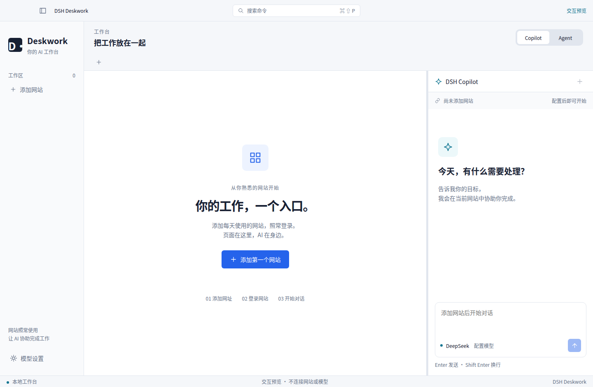
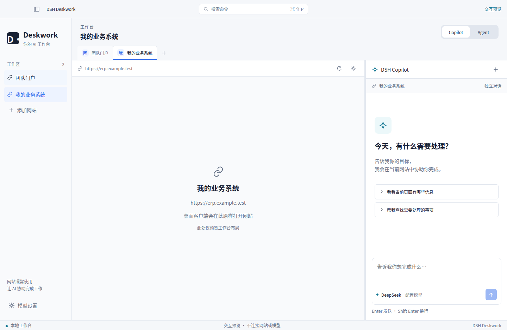
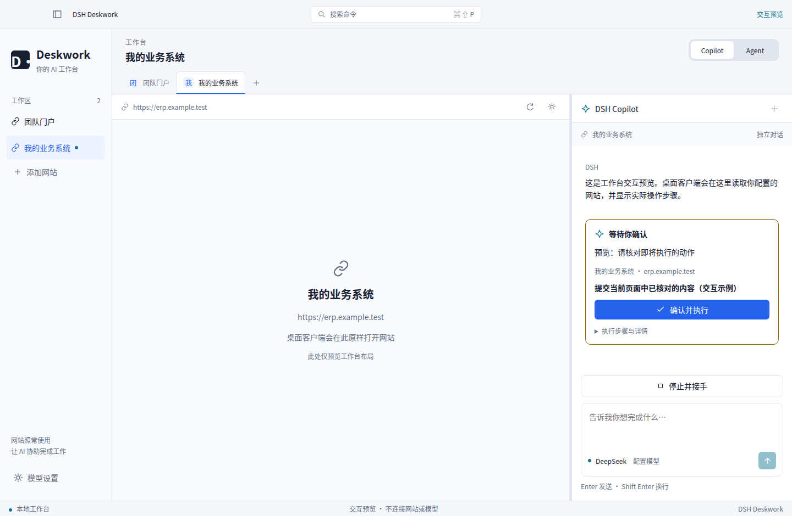
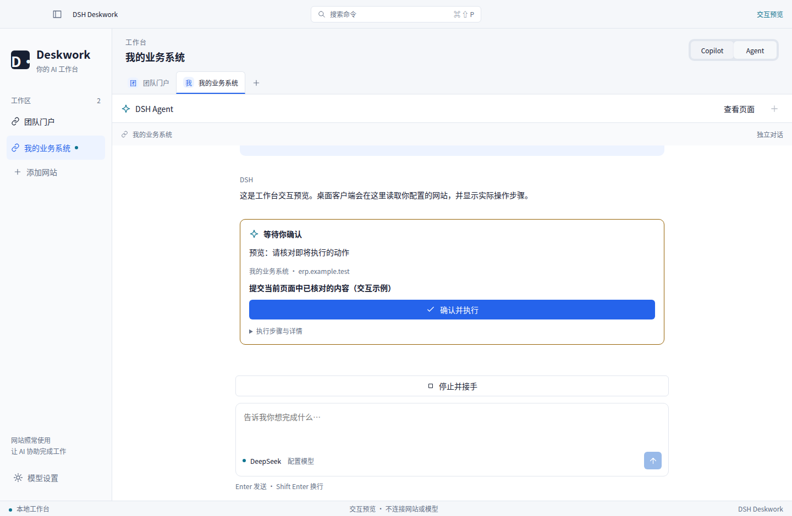
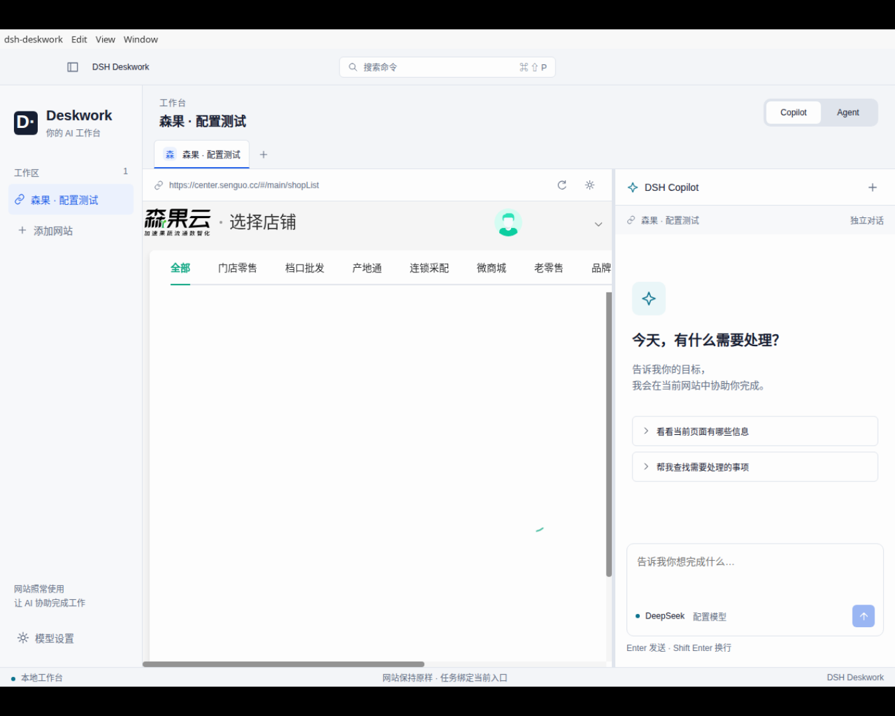

# MVP 界面审阅

前四张来自同一外壳组件的交互预览，网站区域只作中性承载占位。最后一张来自 Linux Electron 的系统屏幕捕获，展示通过配置加载的森果公开页面；没有登录或业务操作。

## 首次启动

## 两个网址、两个固定入口

## Copilot 确认与 Agent 视图

## 原样加载配置网站

视觉原则见 [统一视觉](../visual-system.md)，验证范围见 [本轮证据](../../experiments/2026-09-06-configurable-mvp.md)。
