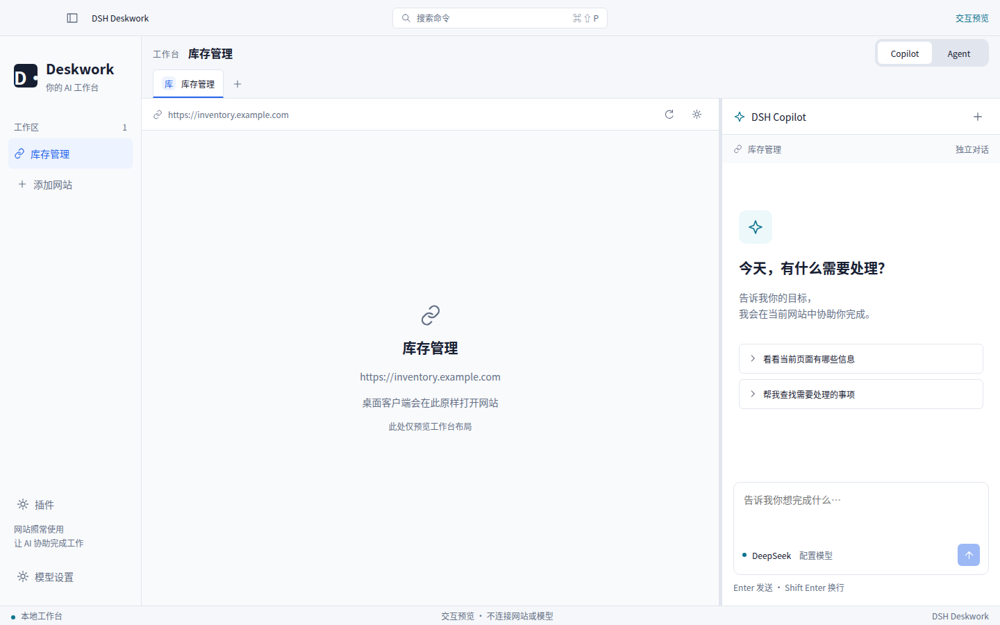
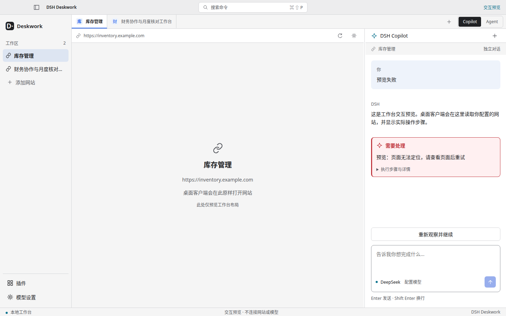
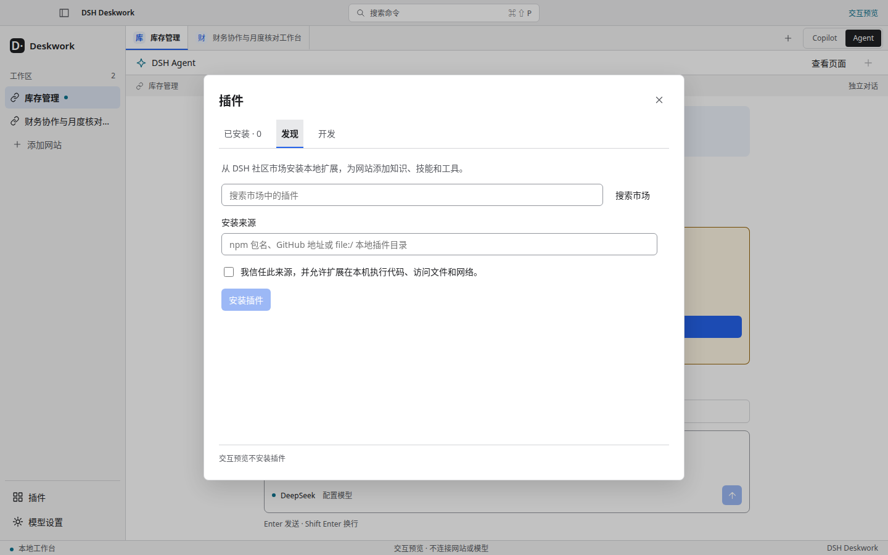
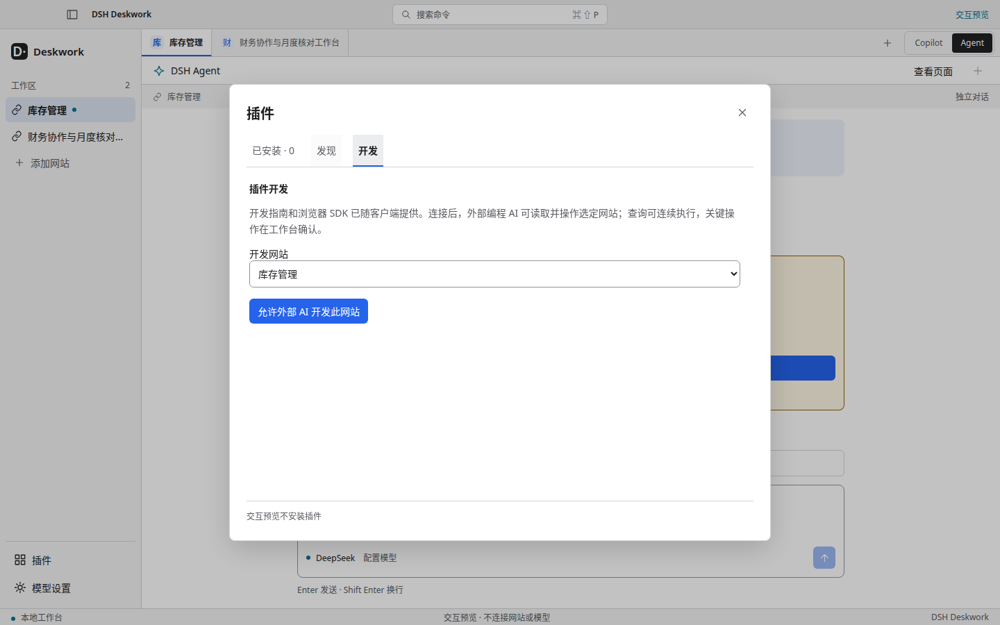

# PC 工作台视觉审阅

2026-09-09：中性浅色、紧凑标签与清晰控件。以下预览复用产品组件，使用虚构网址和通用任务状态；网站区域是中性占位，不代表真实网站操作。1440×900 展示整体布局，1280×800 检查确认卡片。

## 调整前

## 首次启动与固定入口

## Copilot 确认与 Agent

## 插件

## 历史实站证据

以下是早期 Linux Electron 的森果公开页面加载截图，只说明原样加载配置网站，不代表本轮视觉或登录验收。

原则见 [统一视觉](../visual-system.md)，本轮验证见 [PC 视觉更新](../../experiments/2026-09-09-pc-visual-refresh.md)。
