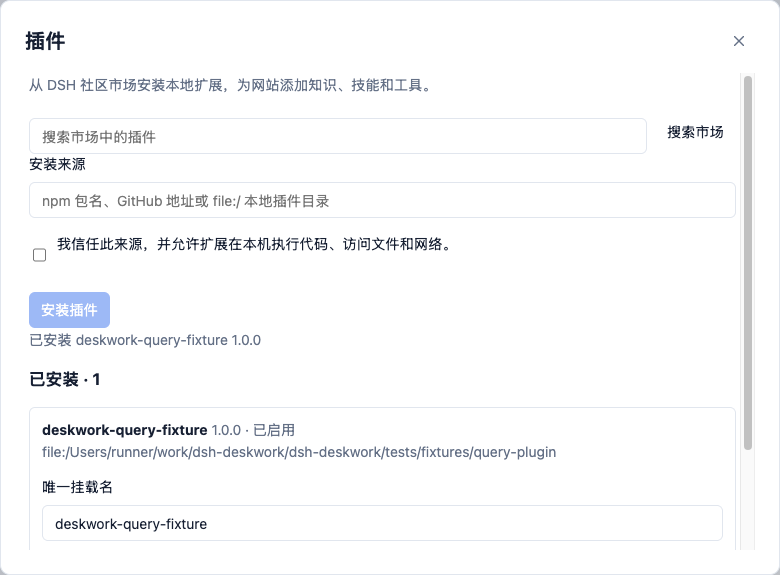

# M2 插件闭环验证

状态：Linux 本地与 macOS arm64 安装包验证通过；样例市场收录与用户 Mac 反馈待完成。运行环境为已授权的本地隔离账号，Electron 实验使用 `--no-sandbox`；这不构成插件沙箱或兼容性承诺。

## 范围与结果

DSH `0.1.2-rc.1`、Electron `44.2.0`、pnpm `11.20.0`。沿用 dsh-market 使用的公开目录 `https://awesome-dsh-plugin.com/plugins.json`，实际搜索返回插件；不执行目录中的 shell 安装文本。对照上游 dsh-market 提交 `ecbd26957130bb43c37d05e3ae9b2bc94cb5ecf1` 选择目录接入而非嵌入完整 Web UI。

- 原生安装、任务环境投影、唯一挂载名、网站绑定、禁用／卸载、更新失败保留旧环境与重启恢复通过。安装使用 DSH CLI 与随包 pnpm，不引入第二种资产协议。
- 真实 DSH 加载标准 bundle，原生 Skill 摘要／正文和查询工具可被模型调用；Electron 执行器也在回归内。
- 真实 Electron 中，从插件管理界面安装夹具插件，对原生下拉框及自定义弹层分别执行查询。两入口任务独立、零确认，宿主工具调用分别为 1 和 3；取消挂载和卸载通过。
- 只读声明只对已安装插件的宿主接口有效，普通模型声明不绕过确认。明显写入、未知影响、停止后动作有负例；原有响应丢失、过期确认和回读回归仍通过。
- 既有双站点真实 DSH／Electron、身份边界回归通过。
- 本地热重载确认插件界面、市场搜索、安装与错误反馈；截图使用合成夹具，不发布真实业务截图或对话。

## 两个实际失败及修复

1. 系统 Node 可加载外部插件，Electron 自带 Node 的 Cordis 包解析失败。显式使用 `--expose-internals` 启动独立 DSH 后通过；回归默认使用 Electron 执行器，安装时也做真实启动验证。
2. 空参数工具直接注册 `{}` 可被宽松模型夹具接受，但真实 DeepSeek 拒绝参数 schema。改为明确的 JSON Schema `type: object`，并在模型夹具校验该边界。

## 真实森果与模型

用户提供身份和密钥，仅在本地私有配置中使用。通过商户中心选择档口批发，勘察当前「对账中心 → 其他收支 → 类别」页面。旧 `/cashierdesk/flow.html` 直达路径出现空白微前端，因此样例改用实际菜单对应的 `/manage/#/main/home/tab/takenote`。此业务知识仅在插件中。

真实 DeepSeek 查询成功：加载 Skill 后调用插件，从首页进入其他收支、展开类别并读取证据。记录为 3 次模型调用、6 次宿主工具调用、约 5.2 秒；未要求确认，未保存、勾选类别或写入业务数据。可见选项不等于遍历所有分组，不声称完整类别目录。从公开插件地址重新安装后，再次完成真实查询；保持类别筛选展开时复用为 3 次模型调用、1 次宿主工具调用、约 3.4 秒。模型调用未减少，减少的是页面工具步骤；这是小样本功能证据，不是普遍效果或性能结论。

## 复现与未完成项

- `npm run check`：格式、文档、类型、lint、行为回归。
- `npm run build` 后运行 `tests/plugin-runtime.integration.ts`、`tests/plugin-desktop.integration.ts`；Linux 桌面使用 Xvfb。
- `scripts/verify-package.ts` 包含原有运行时／桌面测试和新增插件测试；macOS CI 复制 DMG 应用到仓库外验证。

代码提交 `2447ad0b2bc405c56fd39fde9972c68a37cc5c18` 的 [macOS arm64 CI](https://github.com/GuoMonth/dsh-deskwork/actions/runs/34201226662) 通过：源码五项集成测试，DMG 挂载、应用复制到仓库外、临时签名完整性，以及发行包中的四项运行时／桌面／插件测试。所需 pnpm 随包，安装链路由应用内置执行器启动。

交付：[0.2.0-alpha.1 DMG](https://github.com/GuoMonth/dsh-deskwork/releases/tag/v0.2.0-alpha.1)、[标准森果插件包](https://github.com/GuoMonth/dsh-deskwork/releases/tag/senguo-query-v0.1.0-alpha.1)。DMG SHA-256：`88132c4dd36056588bf8b24248f7b7e72c7c87c623240cb03ee3cfc01bc3f8ea`。公开插件 URL 已在真实客户端重新安装通过。

[市场收录 PR #4631](https://github.com/awesome-dsh-plugin/awesome-dsh-plugin/pull/4631) 已提交；上游尚未合并时不能声称样例已经可在市场搜到。用户 Mac 本轮仍待反馈。当前实现、工件与剩余项统一见 [PR #14](https://github.com/GuoMonth/dsh-deskwork/pull/14) 和 Issue #12；原始输出在忽略的 `.artifacts/`，不提交身份或业务数据。

